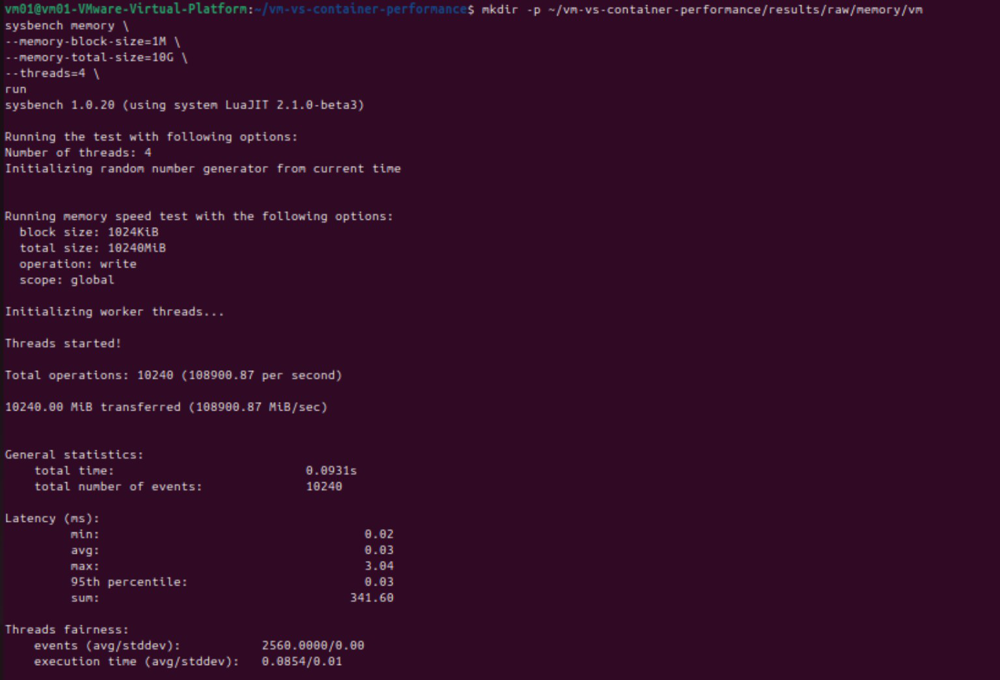

# Experiment 2 – Memory Performance: Virtual Machine vs Docker Container

## 1. Objective
Measure memory-operation throughput and latency with **Sysbench** and compare the identical workload running in a **VM** (Ubuntu on VMware Workstation) and in a **Docker container** (`vm-container-benchmark` image).

## 2. Experimental Parameters

| Parameter | Value |
|---|---|
| Tool | Sysbench 1.0.20 (LuaJIT 2.1.0-beta3) |
| Workload | Memory write |
| Block size | 1M |
| Total size | 10G |
| Threads | 4 |
| Metrics | Operations/sec (MiB/sec), latency |
| Environments | VM, Docker container |

## 3. Procedure

**VM**
```bash
mkdir -p ~/vm-vs-container-performance/results/raw/memory/vm
sysbench memory \
  --memory-block-size=1M \
  --memory-total-size=10G \
  --threads=4 \
  run
```

**Docker container** (same workload)
```bash
mkdir -p ~/vm-vs-container-performance/results/raw/memory/container
docker run --rm \
  vm-container-benchmark \
  sysbench memory \
  --memory-block-size=1M \
  --memory-total-size=10G \
  --threads=4 \
  run
```
[`scripts/benchmark.sh`](scripts/benchmark.sh) automates the 10 repetitions suggested by the lab manual.

## 4. Results

### VM


### Docker container


### Comparison

| Metric | VM | Container |
|---|---|---|
| Total operations | 10,240 | 10,240 |
| Operations/sec | 108,900.87 | 123,725.89 |
| Transfer rate (MiB/sec) | 108,900.87 | 123,725.89 |
| Total time | 0.0931 s | 0.0819 s |
| Latency min | 0.02 ms | 0.02 ms |
| Latency avg | 0.03 ms | 0.03 ms |
| Latency max | 3.04 ms | 1.13 ms |
| Latency 95th pct | 0.03 ms | 0.03 ms |
| Latency sum | 341.60 ms | 312.08 ms |
| Events/thread (avg/stddev) | 2560 / 0.00 | 2560 / 0.00 |
| Execution time (avg/stddev) | 0.0854 / 0.01 s | 0.0780 / 0.00 s |


Container throughput is about **13.6 % higher** than the VM in the captured runs (123,725.89 vs 108,900.87 MiB/sec).

## 5. Observations
1. Both runs use the same configuration (4 threads, 1 MiB blocks, 10 GiB total, write).
2. The container achieved higher throughput and finished faster (0.0819 s vs 0.0931 s).
3. Average latency is identical (0.03 ms); maximum latency is lower in the container (1.13 ms vs 3.04 ms).
4. The container shares the host kernel and avoids an extra guest-OS layer, while the VM adds virtualization overhead on memory management.

> **Note:** these are single captured runs; the lab manual recommends 10 repetitions for statistically robust conclusions, so the difference should be treated as indicative.

## 6. Conclusion
Sysbench memory benchmarking showed the Docker container delivering higher memory throughput and lower worst-case latency than the VM for this workload, consistent with the lighter isolation layer of containers.

## 7. Folder Structure
```
Experiment-2-VM-vs-Container-Memory/
├── README.md
├── images/      # screenshots + comparison chart
├── scripts/     # benchmark.sh, generate_plots.py
└── results/raw/ # place repeated-run outputs here
```
